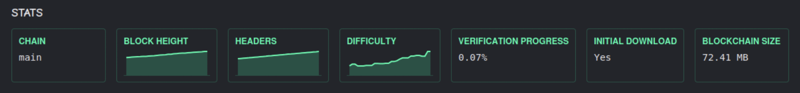

Metrics are a way to communicate stats and other data back into the Dogebox UI, to allow easy consumption by the user.



For example, the Dogecoin Core pup exposes the above metrics, so they user can track the status of their node.

### Definition

Metrics must be defined in your [`manifest.json`](./manifest.mdx) file, under the `metrics` key. Please see [`PupManifestMetric`](/docs/pup/manifest#PupManifestMetric).

<Callout type="info">
There is not currently a limit on how many metrics you can define, though this may change in the future.
</Callout>

```json
{
  ...,
  "metrics": [{
    "name": "my-metric",
    "label": "My Metric",
    "type": "string",
    "description": "My Metric Description",
  }]
}
```

- `name` (`string`): This must match the name of the key your pup communicates back to `Dogeboxd`.
- `label` (`string`): This is the name of the metric as it will appear in the Dogebox UI.
- `type` (`"string" | "int" | "float"`): The type of the metric.
- `history` (`int`): The number of values to keep stored in-memory for this metric.

### Submitting Metrics [#submission]

Metrics are submitted via a `POST` request to the `/dbx/metrics` endpoint of the dogeboxd router.

This is exposed via the [`$DBX_HOST`](/docs/pup/environment#DBX_HOST) & [`$DBX_PORT`](/docs/pup/environment#DBX_PORT) environment variables.

The payload of the request should be a JSON object, with keys matching defined metric `name`s, and values corresponding to the metric's value at this current time.

Example:

```bash
curl -X POST http://${DBX_HOST}:${DBX_PORT}/dbx/metrics \
  -H "Content-Type: application/json" \
  -d '{"my-metric": "12345"}'
```
