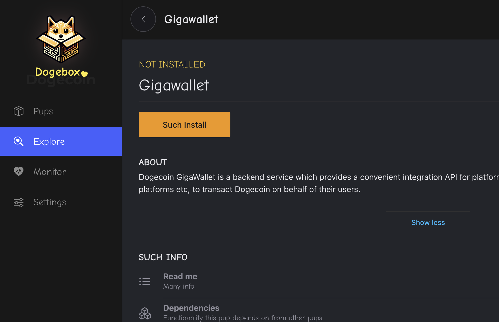

Pups are the lifeblood of the Dogebox, these are packaged services
that the Dogebox runs inside an isolated container, they can depend
on other Pups such as Dogecoin Core or GigaWallet, and thus build up
a functional Dogecoin ecosystem that can provide online shopping,
tipping, new wallets or anything else that interacts with the Dogecoin
Blockchain.

## Explore - The Pup Store [#explore]

Clicking the 'Explore' link in the nav will take you to the 'Pup Store' where all
available Pups can be found.

<Callout type="info">
<b>Note</b>

To start with you will only see a few Pups provided by the Dogecoin Foundation supported 'Pup Source', such as `Dogecoin Core`, `Dogecoin GigaWallet`, `Dogenet` and a few others.

More Pups can be added to the store by adding new 'Pup Sources' (see below).
</Callout>

## Pup Sources - Where do pups come from? [#sources]

Dogebox is designed to let the community create and distribute Pups without
any centralised group controlling a 'store' (hint: like Google or Apple!).

From the Pup Store you can 'manage sources', and paste in a URI to a different
Pup source form the internet. This will be scanned and any pups found will be
available in the Pup Store.

<Callout type="warn">
<b>Note</b>

Currently Sources are Git repositories that follow a particular format, however we are working on other Source types such as decentralised Radicle sources, http and others.
</Callout>

## Pup Installation [#installation]

Clicking a pup from the Pup Store will let you install the Pup. Dogebox will
prepare an isolated 'container' for your Pup to run in, and assign any resources
that your Pup needs based on it's config.

<Callout type="info">
<b>Note</b>

This may take some time as Dogebox will download the source-code for the software
and compile it on your Dogebox. Dogecoin Core may take 10 minutes or more depending on your
hardware. Grab a cuppa and chill.
</Callout>

## Pup Management Screen [#management]

The pup management screen exists for every installed pup, and is the main
control panel for interacting with the software. From here you can monitor the
general Stats of the container, view any custom Mertrics or Logs, and launch
the Pup's own UI (if it provides one!)

## Meeting Dependencies [#deps]

Some pups depend on other pups, they do this via 'Interfaces' and 'Providers'. A pup
that requires an interface provider will let you know by entering the `Unmet Dependencies`
state.

At this point you will need to install or select a pup that 'provides' the required
interface. Don't worry, there's a helpful dialog to get you through this step.

## Enabling / Disabling Pups [#enable-disable]

From the Pup management screen, you can use the 'Enabled' slider to enable or disable
a pup.

<Callout type="info">
<b>Note</b>

This may take a little time as Dogebox is managing interconnected services
related to this Pup, opening or closing firewall ports and updating it's internal
routes.
</Callout>

## Reading Logs [#logs]

For the more technically minded, you can click the 'Logs' action under the Pup management
screen to see the output of the Pup in realtime.

