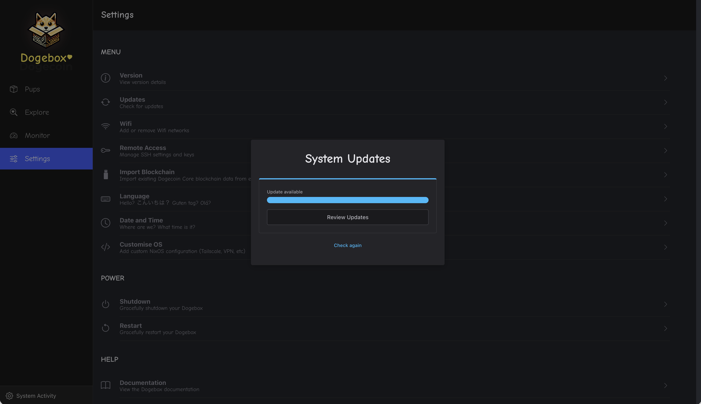
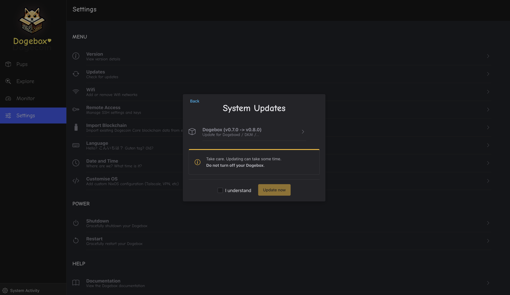
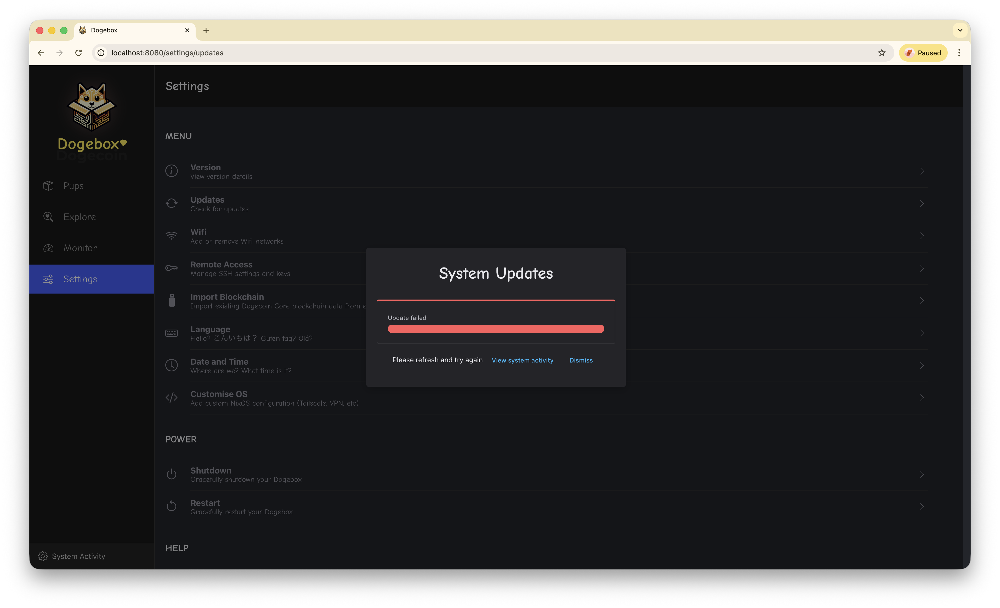

To check for system updates, open the Settings page and select 'Updates'.
You will be shown if your system is up to date or if a new update is avialable.

If an update is available, click 'Review Updates' to see more details and install it.

To go ahead with the update, check 'I Understand' then click 'Update now'. This will take a few minutes so sit tight and do not turn off your Dogebox.

Once completed, a confirmation will show that the update was successful. Congratulations - You've updated your Dogebox!

If an error occurs, click 'View system activity' to see the update job and detailed logs.
