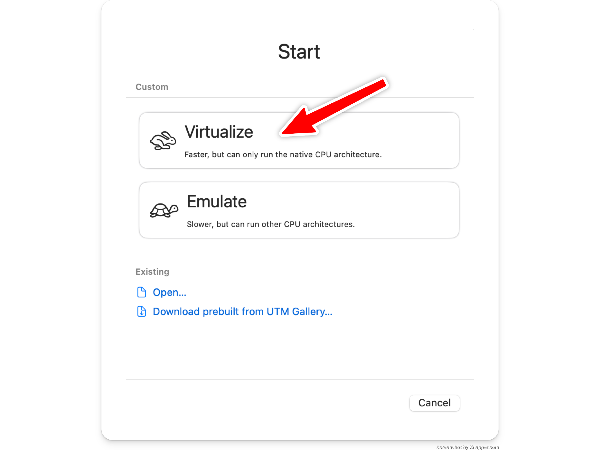
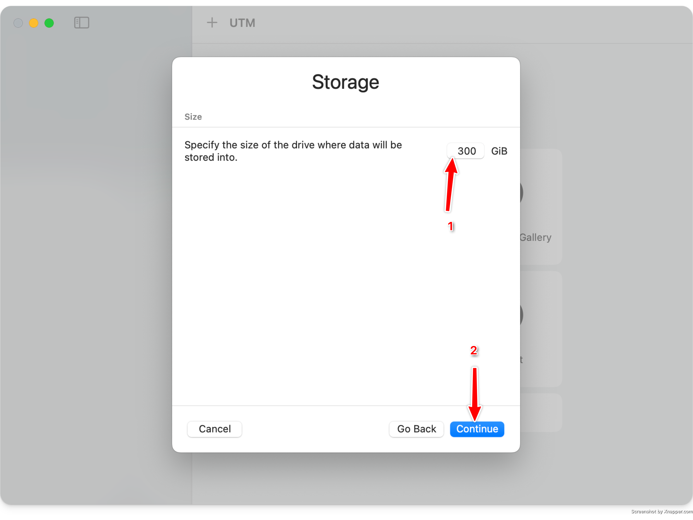

<Callout type="warn">
UTM can only be used on <b>Apple Silicon</b> Macs (M1, M2, M3 models). If you have a different machine, please use a different virtualization software.
</Callout>

## Creating a VM [#create]

#### 1) Create new Machine [#create-1]

#### 2) Select Virtualise [#create-2]

#### 3) Select "Other" operating system [#create-3]

#### 4) Select the downloaded aarch64 ISO file [#create-4]

#### 5) Set the amount of ram you want [#create-5]

The default of `4096mb` is typically fine.

#### 6) Set the amount of storage you want [#create-6]

<Callout>
  UTM uses sparse disk files, so a `500gb` disk will not actually take up `500gb` on your hard drive.
</Callout>

If you wish to sync the blockchain in this VM image, ensure you set this to over `300gb`.

#### 7) Skip any shared directory configuration [#create-7]

#### 8) Name your VM image and open settings [#create-8]

#### 9) Configure Bridged networking [#create-9]

- Select `Network` on the lefthand side.
- Change `Network Mode` to `Bridged (Advanced)`

#### 10) Add serial monitor interface (optional)

 - Click on `New...` in the `Devices` section on the lefthand side.
 - Select `Serial` from the drop down menu.
 - Click the new `Serial` entry in the `Devices` section.
 - Make sure the `Mode` is set to `Built-in Terminal`

 When starting up the virtual machine, there will be a window with log messages
 and a login prompt once the machine is done booting.

#### 11) Save & Launch [#create-10]

## Configuring [#configuring]

Once you have booted your VM, please continue with the [installation guide](/docs/usage/setup/access).
