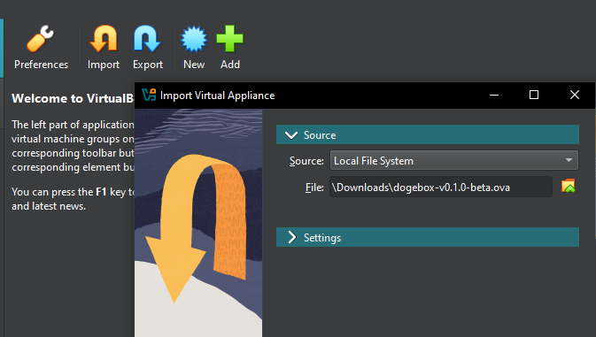

## Creating a VM [#create]

#### 1) Import the OVA image [#create-1]

Click `Import` and then select the OVA file you downloaded. If you don't have the OVA file, please see [Getting Dogebox](/docs/usage/getting-dogebox).

#### 2) Set RAM [#create-2]

A value of `4096mb` is typically fine.

#### 3) Configure Network [#create-3]

Once imported, click `Settings` and configure your Virtual Machine's network to use `bridged mode`.

This is required so you can visit the Dogebox DPanel in your web browser.

#### 4) Launch the VM [#create-4]

Launch the VM. This may take up to 10 minutes depending on your internet connection, to configure itself initially, grab a cuppa.

## Configuring [#configuring]

Once you have booted your VM, please continue with the [installation guide](/docs/usage/setup/access).
