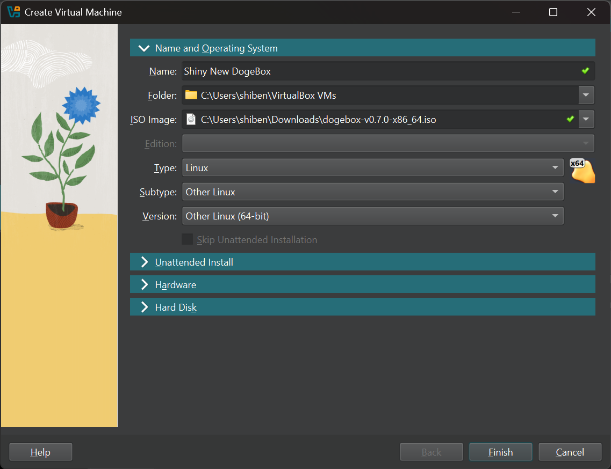
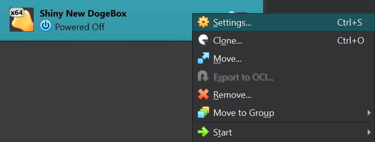
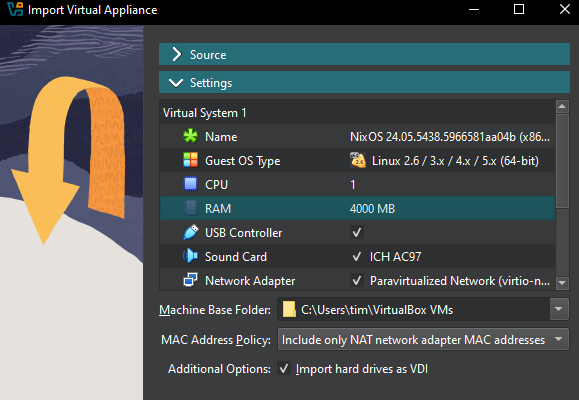
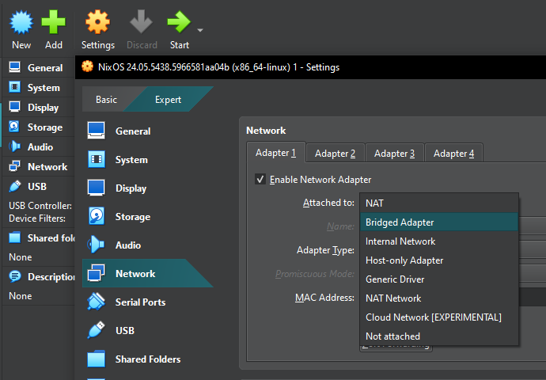

## Creating a VM [#create]

## Using an ISO image

#### 1) Create new blank VM [#iso-1]

See [Getting Dogebox](/docs/usage/getting-dogebox) if you don't already have an ISO image, then create a new blank VM.

#### 2) Name and Operating System [#iso-2]

Give the new VM a name, select your downloaded ISO image.  Select type 'Linux', subtype 'Other Linux', version 'Other Linux (64-bit).

#### 3) Hardware [#iso-3]

Move to the hardware section.  We'd recommend at least 8GB of RAM and 2 CPUs when running a core node, but adjust these based on what you intend to use the VM for.

Check 'Enable EFI'.  This is important, as the ISO will boot without EFI, but the installed system won't.

#### 4) Hard disk [#iso-4]

Set the disk at whatever size you need.  The OS will fit in 64G, a full copy of the blockchain will need a few hundred.

By default virtualbox will use a sparse image, which will only be as big as the amount space you have used on your real storage.

#### 5) Network [#iso-5]

After selecting 'finish', open the new VM's settings and select 'network'.  The first adapter should have 'attached to' set to 'NAT', change this to 'Bridged Adapter' and select OK.

#### 6) Power On [#iso-6]

Power on the VM, then proceed with the [installation guide](/docs/usage/setup/access).

## Using an OVA virtual appliance image

#### 1) Import the OVA image [#ova-1]

Click `Import` and then select the OVA file you downloaded. If you don't have the OVA file, please see [Getting Dogebox](/docs/usage/getting-dogebox).

#### 2) Set RAM [#ova-2]

A value of `4096mb` is typically fine.

#### 3) Configure Network [#ova-3]

Once imported, click `Settings` and configure your Virtual Machine's network to use `bridged mode`.

This is required so you can visit the Dogebox DPanel in your web browser.

#### 4) Launch the VM [#ova-4]

Launch the VM. This may take up to 10 minutes depending on your internet connection, to configure itself initially, grab a cuppa.

## Configuring [#ova-5]

Once you have booted your VM, please continue with the [installation guide](/docs/usage/setup/access).
