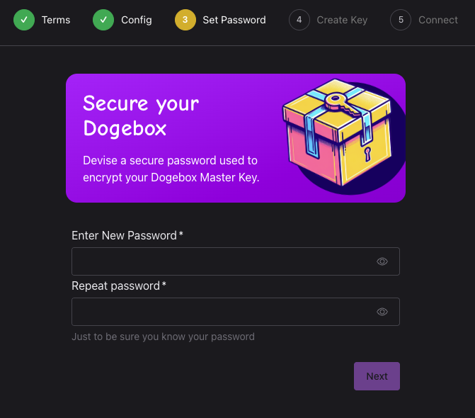

## Configuration

After the installation, you'll need to go through the initial configuration,

#### 1) Terms [#configuration-1]

Welcome to Dogebox! Please read and accept the terms and conditions

#### 2) Config [#configuration-2]

Set your device name and preferred keyboard layout.
Also select your mass storage disk, note this may be different to your installation location and if you plan to sync the Dogecoin blockchain will require plenty of space.

Advanced options allow you to disable the use of the Dogecoin Foundation's binary caches.
These binary caches contain pre-build binaries for Dogebox OS and the Foundation's supported Pups, which when used will speed up the installation process.

#### 3) Password [#configuration-3]

Set your password, make sure it's secure!

#### 4) Master Key [#configuration-4]

Generate your master key. 

Ensure it's noted down in a secure location.

#### 5) Connect [#configuration-5]

Select a network for Dogebox to join. This may be ethernet or WiFi.
You may also add an SSH key to enable SSH.

#### 6) Complete [#configuration-5]

On pressing 'Much Connect' on the connect screen, your configuration settings will be applied and the device will reboot.
Once completed, the 'Launch Dogebox' button will be enabled, allowing you to to load the main Dogebox UI.

