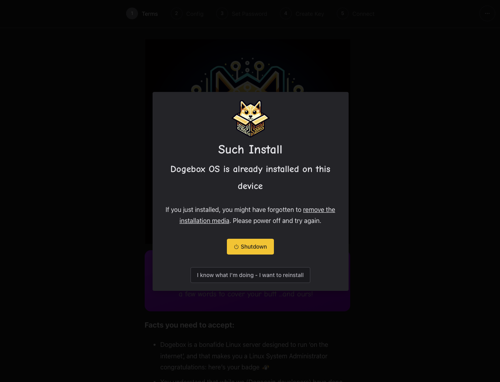
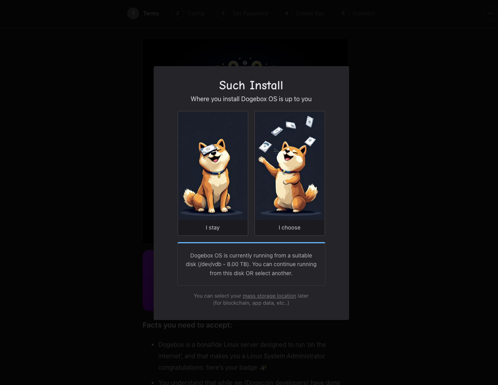
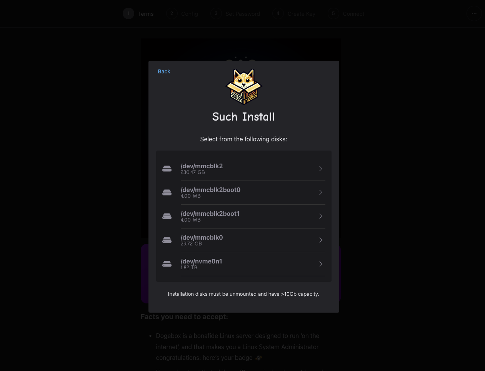
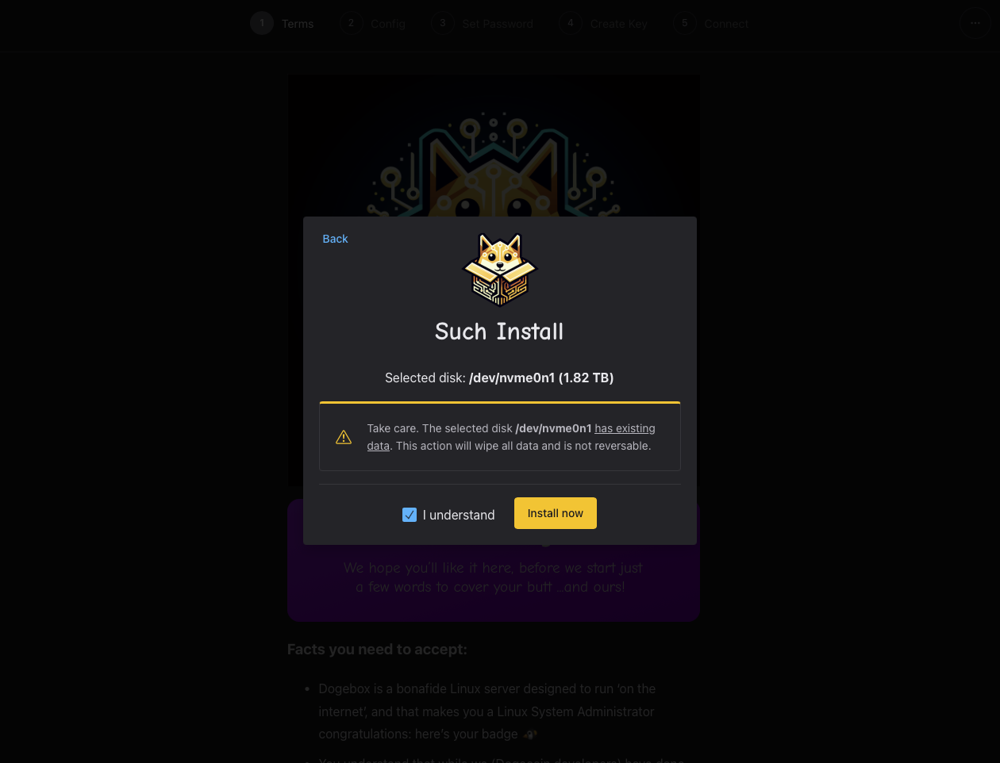
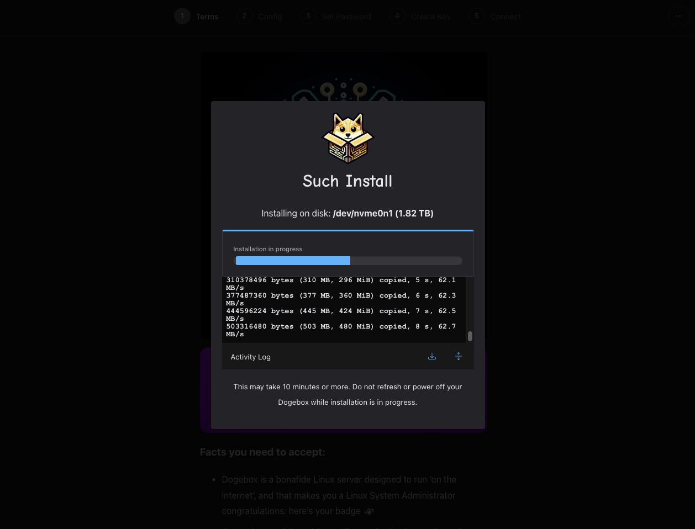
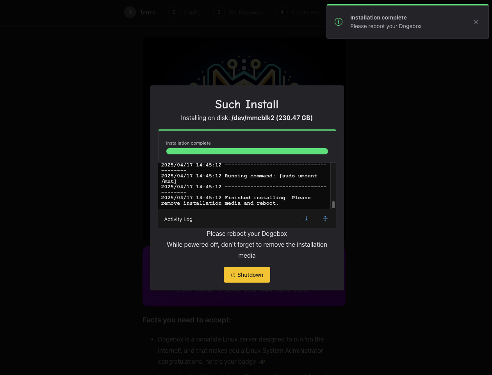

## Installing Dogebox OS

#### 1) Existing installation [#install-1]

When an existing Dogebox OS installation is detected, a warning will be shown.
If you've just performed an installation, you may have forgotten to remove the installation media. If so, power off, remove it and try again.
If you're re-installing, press **'I know what I'm doing - I want to reinstall'**

#### 2) Select installation location [#install-2]

Install Dogebox OS to the current disk shown in the description with 'I stay', or choose a new location with 'I choose'.
The option to stay on the current disk will be greyed out if the current disk is the installation media (For example, when installing via MicroSD card on a T6)

If you selected 'I choose', select an installation disk and confirm your selection. For the Dogebox you'll have to choose `mmcblk2`. This is the internal bootable disk where the operating system needs to residei. **Make sure you understand that any existing data on your selected disk will be wiped**

#### 3) Installation [#install-3]

The installation will now commence.
Progress, as well as any warnings or errors will be shown in the activity log.

Once installation is completed, you will be prompted to remove your installation media if used, and reboot the machine.

